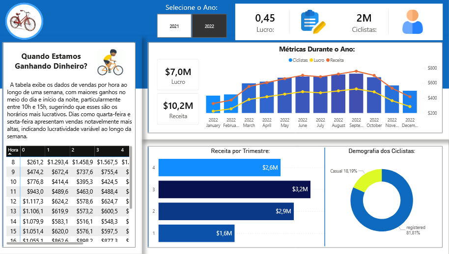

# Dashboard de Análise de Vendas – Loja de Bicicletas

Dashboard interativo desenvolvido no Power BI para análise de **lucro, receita, comportamento de vendas ao longo do ano e perfil dos ciclistas**, com foco em identificar padrões de lucratividade e sazonalidade.

### O painel permite visualizar métricas estratégicas e entender **quando a empresa está ganhando mais dinheiro**, além de analisar o perfil dos clientes.
---

---

## Objetivo do Projeto:

Desenvolver um dashboard executivo para:

- Monitorar lucro e receita anual
- Identificar sazonalidade nas vendas
- Analisar receita por trimestre
- Compreender o perfil dos ciclistas
- Apoiar decisões estratégicas baseadas em dados

---

## Principais KPIs:

-  **Lucro Total:** $7,0M  
- **Receita Total:** $10,2M  
- **Margem de Lucro:** 0,45  
- **Total de Ciclistas:** 2M  
---
## Análises Disponíveis:

### Métricas Durante o Ano

Gráfico combinado exibindo:

- Ciclistas (volume)
- Receita
- Lucro

Permite identificar:
- Meses de maior rentabilidade
- Correlação entre número de ciclistas e receita
- Períodos de queda ou crescimento

---

### Quando Estamos Ganhando Dinheiro?

Tabela detalhada de vendas por hora ao longo da semana.

Principais insights:

- Maiores ganhos concentrados entre **10h e 15h**
- Quartas e sextas-feiras apresentam vendas mais altas
- Existe variação significativa ao longo do dia

Esse tipo de análise ajuda na:
- Definição de escala de funcionários
- Otimização de campanhas promocionais
- Melhor alocação operacional

---

### Receita por Trimestre

Distribuição da receita:

- 1º Trimestre – $1,6M  
- 2º Trimestre – $2,9M  
- 3º Trimestre – $3,2M  
- 4º Trimestre – $2,6M  

O 3º trimestre apresenta o maior desempenho.
---
### Demografia dos Ciclistas

- Registered – 81,81%  
- Casual – 18,19%  

A maior parte dos clientes é recorrente (registrada), indicando fidelização.

---
## Filtros Interativos

O dashboard permite selecionar:

- Ano (2021 ou 2022)

Facilitando comparações e análises temporais.
---
## Principais Insights Estratégicos:

- Existe forte sazonalidade ao longo do ano.
- O lucro acompanha o crescimento da receita, mas varia conforme o volume de ciclistas.
- Horários específicos concentram maior rentabilidade.
- Alta taxa de clientes registrados indica bom nível de retenção.
---
